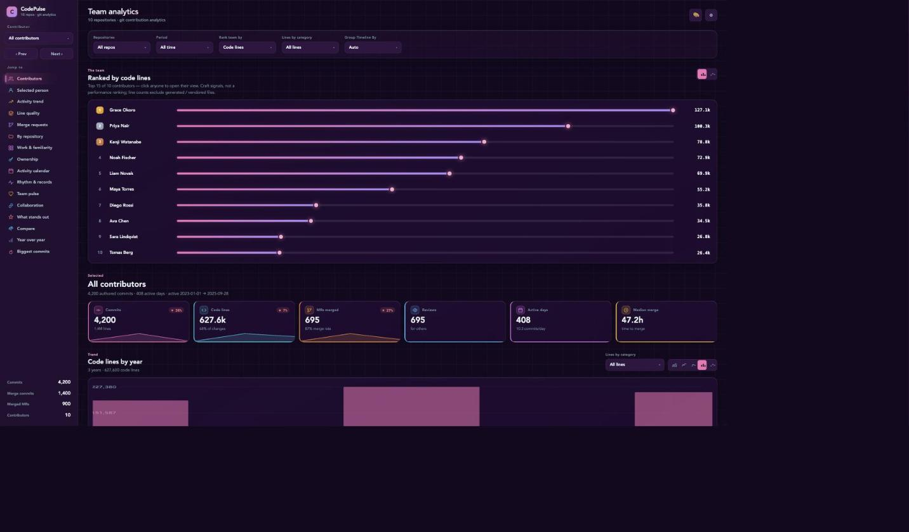
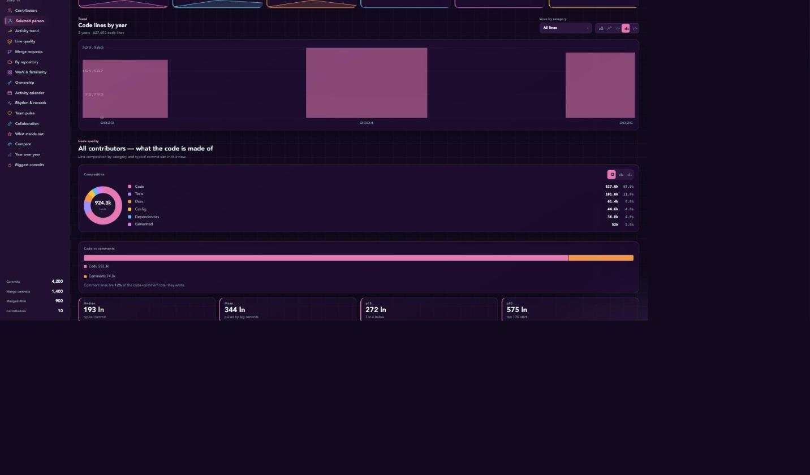
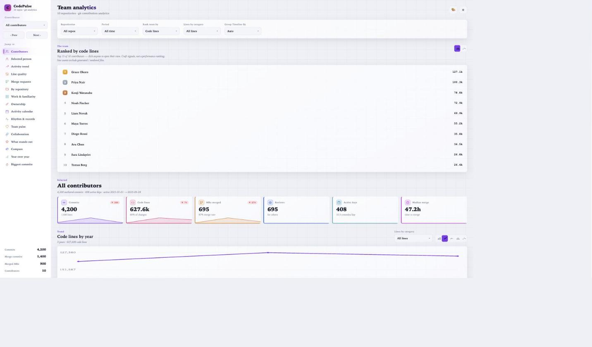

# CodePulse

**Git contribution analytics that runs entirely in your browser.** Point it at a snapshot
of your team's commit history and it turns raw git activity into a readable story — who is
shipping what, where the code lives, how review flows, and where knowledge is concentrated —
without a single byte leaving the device.

The whole interface re-skins live from one theme file: colors, fonts, radius, density, layout
width, and even chart types are tokens. Switching a theme repaints the dashboard instantly and
never re-renders the charts.



> _Screenshots use synthetic, generated data — fictional contributors, repositories, and services._

---

## Highlights

- **Runs 100% client-side.** No backend, no server round-trips. Parsing, aggregation, and
  rendering all happen in the browser; your data is stored locally (IndexedDB + localStorage).
- **A full analytics engine in the browser** — a single `buildCell` aggregation computes, for any
  contributor and any filter slice: commits, lines by category (code / test / docs / config /
  deps / generated), code-vs-comment split, active days, commit-size distribution, per-period
  trend, per-repository breakdown, merge/merge-request stats, service ownership, and the biggest
  landings.
- **Craft over volume.** Rankings are framed as *craft signals, not a performance review* —
  generated and vendored lines are excluded, and a raw-volume rank is always shown alongside.
- **Live-themeable design system.** Six built-in themes (`aurora`, `blueprint`, `forest`,
  `paper`, `pop`, `vapor`); a theme can even suggest chart encodings, while an explicit user
  choice always wins.
- **Bring your own data.** Import a `facts.json` snapshot produced by your pipeline, or connect a
  GitHub / GitLab account and fetch directly from the provider API.
- **Deep, shareable views.** Filters (repositories, period, rank-by metric, line category,
  timeline granularity) live in the URL as removable chips, so any slice is a link.

## The views

Every section reads for the whole team or drills into a single contributor:

| Section | What it shows |
| --- | --- |
| **Contributors** | Leaderboard ranked by the chosen metric (bar / lollipop / list) |
| **Selected person** | KPI cards with deltas and sparklines for the person in view |
| **Activity trend** | Commits / lines / code / MRs over time (area · line · step · bars) |
| **Line quality** | Composition donut, code-vs-comment split, commit-size percentiles |
| **Merge requests** | MR volume, merge rate, time-to-merge, states, by-year |
| **By repository** | Commits per repo, front-end / back-end coloured apart |
| **Work & familiarity** | Commit types and the service areas a person knows best |
| **Ownership** | Bus-factor view — each service's top owner and fragility |
| **Activity calendar** | Day-by-day heatmap and weekday rhythm |
| **Compare** | Two-to-four contributors head to head: craft vs. output |
| **Year over year** | Commits per year with the change against the year before |
| **Biggest commits** | The largest single landings, linked to the commit |

## Screenshots

**Line composition & commit-size analysis**



**The same dashboard, a different theme** — everything is a token, so a theme change repaints the
whole UI live:



---

## Getting started

Requires Node 18+ and npm.

```bash
npm install
npm start          # dev server at http://localhost:4200
npm run build      # production build to dist/
npm run format     # prettier over src/
```

On first run CodePulse has no data and opens the setup screen. Two ways to load a dataset:

1. **Import a snapshot** — choose a `facts.json` produced by your pipeline. It is stored locally
   in the browser for next time.
2. **Connect a provider** — add a GitHub or GitLab workspace (host, username, token, repositories)
   and fetch commits and merge/pull requests via the API.

> **Your data stays on your device.** Datasets live in IndexedDB; accounts and preferences in
> localStorage. Provider tokens, if you use them, are stored in the browser so the account
> survives across sessions — use a read-only, minimally-scoped token. Nothing is ever uploaded.

## Data model

A dataset is a compact, column-indexed snapshot — arrays of fact rows referencing lookup tables
(persons, repositories, types, services), plus merges, merge/pull requests, and per-service line
ownership. The analytics engine reads that snapshot and derives every metric on demand for the
current filter slice. The real snapshot is personal data and is **git-ignored** — see
`.gitignore`.

## Project structure

```
src/
├─ app/
│  ├─ core/                     # data + state layer (framework-agnostic)
│  │  ├─ types/                 # Facts / analytics / filters / theme / account models
│  │  ├─ constants/             # metric definitions, theme token map, defaults
│  │  ├─ store/                 # signal stores: facts, analytics, filters, theme, nav, account
│  │  └─ utils/                 # IndexedDB dataset, provider fetch, formatting
│  └─ dashboard/                # standalone view components (one per section) + shared widgets
│     ├─ types/                 # per-component view models
│     └─ constants/             # chart layout, calendar, trend, quality constants
├─ assets/themes/               # aurora · blueprint · forest · paper · pop · vapor
└─ styles.scss                  # design-system tokens + global chart animations
```

## Tech

- **Angular 19** standalone components, signals, `OnPush`, zoneless change detection, and the
  new `@if` / `@for` / `@switch` control flow.
- **Custom SVG charts** bound to CSS custom properties, so a theme switch repaints without
  re-rendering — only a change of chart *type* redraws.
- **No chart or state libraries** — the analytics engine, charts, and theming are hand-built.
- PapaParse for CSV ingestion; everything else is dependency-free.

## Conventions

Standalone components, one exported view per file, `dot.case` filenames; types, constants, and
utilities live in dedicated barreled directories; enums over string unions; charts and colors are
driven by design tokens (`var(--token)`), never hard-coded.
